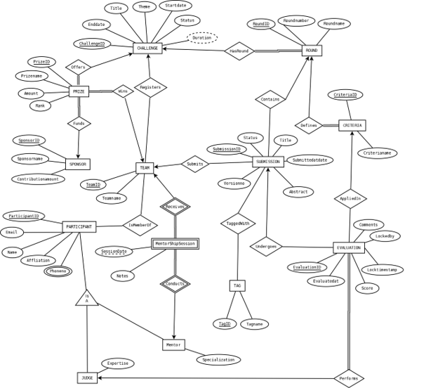

# Innovation Challenge Management System (ICMS)

A database-driven system designed to manage innovation competitions and hackathons from participant registration to project evaluation, mentorship, and prize distribution.

## Tech Stack

<p align="left">
  
  &nbsp;
  
  &nbsp;
  
  &nbsp;
  
</p>

**Oracle SQL • PL/SQL • PHP • HTML5 • JavaScript**

## Overview

The **Innovation Challenge Management System (ICMS)** is designed to manage innovation competitions and hackathons in a structured database environment.

The system manages the complete competition workflow, including challenge creation, team registration, project submissions, judging, mentorship, sponsors, prizes, and results.

## Features

- Challenge creation and management
- Multiple challenge rounds
- Participant registration
- Team creation and membership management
- Project submission management
- Submission tagging
- Judge assignment and evaluation
- Evaluation criteria and scoring
- Mentor and mentorship session management
- Sponsor management
- Prize and winner management
- Competition progress tracking
- Database locking and transaction handling

## Database Design

The database was designed using relational database principles and normalized up to **Third Normal Form (3NF)**.

### Main Entities

- Challenge
- Round
- Participant
- Participant Phone
- Team
- Team Participant
- Submission
- Tag
- Submission Tag
- Criteria
- Judge
- Mentor
- Evaluation
- Mentorship Session
- Sponsor
- Prize

## Database Implementation

The database was implemented using **Oracle SQL and PL/SQL**.

Concepts implemented include:

- Primary Keys
- Foreign Keys
- Composite Keys
- NOT NULL constraints
- UNIQUE constraints
- CHECK constraints
- Sequences
- Joins
- Subqueries
- Single-row functions
- Group functions
- PL/SQL variables
- Operators
- Loops
- Conditional statements
- Explicit cursors
- Stored procedures
- Stored functions
- Triggers
- Packages
- Implicit locking
- Explicit locking

## Project Structure

```text
innovation-challenge-management-system/
│
├── database/
│   ├── schema.sql
│   ├── sequences.sql
│   ├── sample_data.sql
│   ├── plsql_basic.sql
│   ├── plsql_advanced.sql
│   └── locking_queries.sql
│
├── diagrams/
│   ├── er-diagram.png
│   ├── schema-diagram.png
│   ├── class-diagram.png
│   ├── use-case-diagram.jpg
│   └── activity-diagram.jpg
│
├── screenshots/
│   ├── login.png
│   ├── organizer-dashboard.png
│   ├── participant-dashboard.png
│   ├── judge-dashboard.png
│   └── mentor-dashboard.png
│
├── docs/
│   └── ICMS_Project_Report.pdf
│
└── README.md
```

## ER Diagram

<p align="center">
  
</p>


## Schema Diagram

<p align="center">
  
</p>


## System Interfaces

### Organizer Dashboard

<p align="center">
  
</p>


The organizer can manage challenges, rounds, teams, judges, mentors, sponsors, prizes, and competition progress.

### Participant Dashboard

<p align="center">
  
</p>


Participants can register for challenges, manage their teams, and submit projects.

### Judge Dashboard

<p align="center">
  
</p>


Judges can view assigned submissions and provide scores and comments.

### Mentor Dashboard

<p align="center">
  
</p>


Mentors can manage assigned teams and record mentorship sessions.

## Key Database Relationships

- A challenge can contain multiple rounds.
- Teams register for challenges.
- Participants can belong to teams.
- Teams can submit projects for different rounds.
- Submissions can have multiple tags.
- Rounds define evaluation criteria.
- Judges evaluate submissions according to criteria.
- Mentors conduct mentorship sessions with teams.
- Sponsors fund prizes.
- Prizes are awarded to winning teams.

## Running the Database

Execute the SQL files in the following order:

```text
1. schema.sql
2. sequences.sql
3. sample_data.sql
4. plsql_basic.sql
5. plsql_advanced.sql
6. locking_queries.sql
```

The database implementation was developed for **Oracle Database** using Oracle SQL and PL/SQL.

## Academic Context

Developed as a group project for the **Advanced Database Management System** course at **American International University-Bangladesh (AIUB)**.

## Team Members

| Member                   | GitHub                                                  |
| ------------------------ | ------------------------------------------------------- |
| Tasfiah Tasnim Mrinmoyee | [GitHub Profile](https://github.com/tasfiahmrinmoyee)   |
| Samiha Chowdhury         | [GitHub Profile](https://github.com/Samiha-Chowdhury-9) |
| MD Alif Ziad Sarkar      | [GitHub Profile](https://github.com/Alif-ziad)          |
| MD Tanvirul Islam Nayem  |                                                         |
